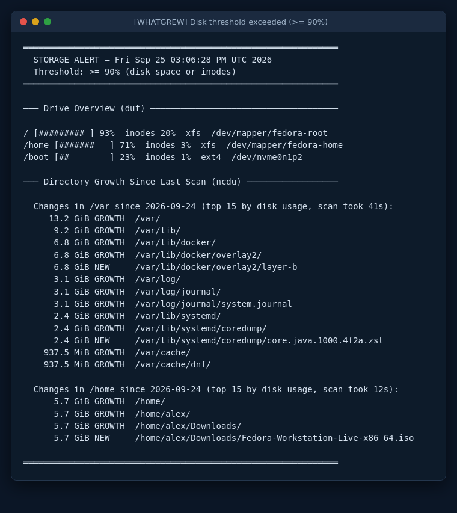

<p align="center">
  
</p>

# whatgrew

[](https://github.com/bspwnmaster/whatgrew/actions/workflows/shellcheck.yml)
[](LICENSE)


**A disk-space monitor that tells you *what* grew, not just *that* the disk is full.**

Most disk alerts say "`/` is at 93%" and leave you to go hunting with `du`. whatgrew's alert shows what grew, so you know where to look before you log in:

<p align="center">
  
</p>

It's a single bash script run by cron. It needs no agent, daemon or database. The same example is shown as text under [Reading the alert](#reading-the-alert).

---

## Contents

1. [How it works](#how-it-works)
2. [Install](#install)
3. [Configuration](#configuration)
4. [Reading the alert](#reading-the-alert)
5. [Limitations](#limitations)
6. [Setting up email](#setting-up-email)
7. [Troubleshooting](#troubleshooting)
8. [Upgrading and uninstalling](#upgrading-and-uninstalling)
9. [Security notes](#security-notes)
10. [License](#license)

---

## How it works

<h1>
  
</h1> 

Two cron jobs run the same script:

- **Every hour**, `whatgrew.sh` checks every real disk with `duf`, which takes milliseconds. If nothing is at or over the threshold, it exits without output. If a disk is, it rescans your chosen folders with `ncdu`, compares them with the last saved scan, and sends an alert. It sends **at most one alert every 24 hours**.
- **Every day at 03:00**, `whatgrew.sh --scan` saves a scan of those folders. This means there's always an earlier scan to compare against when an alert fires.

A disk counts as over the threshold when either its **space** or its **inodes** (the number of files it can hold) are at or above `THRESHOLD`.

Only real local disks are checked. whatgrew skips `tmpfs`, `/proc`, network mounts, zero-size devices, anything mounted read-only (DVDs, ISO images), and container filesystems (Docker/Podman `overlay` mounts, whose files live on a disk that is checked on its own). A disk that is only set to remount read-only if an error happens (`errors=remount-ro`, common on ext4) *is* checked.

---

## Install

**Requirements:** Linux with bash 4.4+ and GNU coreutils (any current Fedora, RHEL, Debian or Ubuntu), root access, and these packages:

| Package | Why | Fedora / RHEL | Debian / Ubuntu |
|---|---|---|---|
| `duf` | reads disk usage | `duf` | `duf` |
| `ncdu` | scans folders | `ncdu` | `ncdu` |
| `jq` | processes JSON | `jq` | `jq` |
| `flock` | stops two runs overlapping | `util-linux` (usually preinstalled) | `util-linux` (usually preinstalled) |
| cron | runs the schedule | `cronie` | `cron` (usually preinstalled) |
| `mail` *(optional)* | email alerts | `s-nail` | `bsd-mailx` |

> If your package manager has no `duf` (RHEL without EPEL, Ubuntu before 22.04), download a package from the [duf releases page](https://github.com/muesli/duf/releases).

**Already comfortable with cron?** This is the whole install. The steps below explain each line.

```bash
curl -fLO https://github.com/bspwnmaster/whatgrew/releases/latest/download/whatgrew-v1.sh
sudo dnf install duf ncdu jq util-linux cronie        # or: sudo apt install duf ncdu jq util-linux cron
sudo install -o root -g root -m 750 whatgrew-v1.sh /usr/local/bin/whatgrew.sh
sudo vi /usr/local/bin/whatgrew.sh                   # set THRESHOLD, ALERT_EMAIL, SCAN_PATHS
sudo /usr/local/bin/whatgrew.sh --scan               # first scan, to compare against later
sudo crontab -e                                      # add the three lines from step 5
```

### 1. Download the script

You only need the one file, `whatgrew-v1.sh`:

```bash
cd ~
curl -fLO https://github.com/bspwnmaster/whatgrew/releases/latest/download/whatgrew-v1.sh
```

Or download it in your browser from the [latest release](https://github.com/bspwnmaster/whatgrew/releases/latest). Run the commands below from the folder the file is in.

> 💡 Read the script before you run it as root. It's plain bash with comments throughout.

### 2. Install the packages

```bash
# Fedora / RHEL
sudo dnf install duf ncdu jq util-linux cronie
sudo systemctl enable --now crond

# Debian / Ubuntu
sudo apt install duf ncdu jq util-linux cron
```

For email alerts, also install `s-nail` (Fedora) or `bsd-mailx` (Debian/Ubuntu), then see [Setting up email](#setting-up-email).

### 3. Install the script

```bash
sudo install -o root -g root -m 750 whatgrew-v1.sh /usr/local/bin/whatgrew.sh
```

This installs it as `whatgrew.sh`, owned by root, so other users can't read or change what root runs every hour.

### 4. Configure

Settings are variables at the top of the installed script:

```bash
sudo vi /usr/local/bin/whatgrew.sh
```

Most people only change these three:

```bash
THRESHOLD=90                        # alert when a disk (or its inodes) is >= 90% full
ALERT_EMAIL="ops@example.com"       # "" = no email; cron mails the output instead
SCAN_PATHS=( "/var" "/home" )       # folders to scan and compare
```

Pick `SCAN_PATHS` by what tends to grow on the machine:

| Machine | `SCAN_PATHS` |
|---|---|
| General server / VM | `( "/var" )` |
| Web server | `( "/var" "/srv" )` |
| Database server | `( "/var/lib/postgresql" "/var/log" )` |
| Desktop / multi-user | `( "/var" "/home" )` |
| Docker host | `( "/var/lib/docker" "/var/log" )` |

Rules for paths:

- They must be absolute and use only letters, numbers and `. _ - /`, with no `.` or `..` components.
- Paths that don't exist on a machine are skipped without a warning, so one config can be shared across servers.
- A scan **stays on one filesystem**. If `/var/log` is a separate disk, scanning `/var` won't include it, so list it separately.
- **Don't list a folder together with one of its parents on the same disk.** `( "/var" "/var/log" )` or `( "/" "/var" )` scans the inner folder twice and reports its growth twice. List the parent only.
- `( "/" )` works and covers everything on the root disk, but the scan takes longer and needs more memory (roughly 170 MiB per 250,000 files). Time the first run, and raise `TOP_CHANGES` (see below).

Then take the first scan and note how long it takes:

```bash
time sudo /usr/local/bin/whatgrew.sh --scan
```

It should normally finish within a few minutes. If it takes much longer, scan narrower folders (see the time limits in [Configuration](#configuration)).

### 5. Schedule it

```bash
sudo crontab -e
```

Add:

```cron
MAILTO=ops@example.com
0 3 * * * /usr/local/bin/whatgrew.sh --scan
0 * * * * /usr/local/bin/whatgrew.sh
```

`MAILTO` emails you anything the script prints, including errors. Set it even if you use `ALERT_EMAIL`: it's how you find out if the monitor itself breaks.

The two jobs can't collide. A lock makes one wait for the other to finish.

### 6. Check that alerts arrive

Temporarily lower the threshold so an alert fires straight away:

```bash
sudo sed -i 's/^THRESHOLD=90/THRESHOLD=1/' /usr/local/bin/whatgrew.sh
sudo rm -f /var/lib/whatgrew/last_alert
sudo /usr/local/bin/whatgrew.sh
sudo sed -i 's/^THRESHOLD=1/THRESHOLD=90/' /usr/local/bin/whatgrew.sh    # put it back!
sudo rm /var/lib/whatgrew/last_alert                                   # re-arm real alerts
```

You should get the alert email, or see the report in your terminal if `ALERT_EMAIL` is empty. The last line matters: otherwise your test counts as today's alert, and a real one wouldn't be sent for 24 hours.

---

## Configuration

All settings are variables near the top of the script. Sizes are in bytes and times in seconds.

**Basics**

| Setting | Default | What it does |
|---|---|---|
| `THRESHOLD` | `90` | Alert when a disk's space **or** inode usage is at or above this %. Space is calculated like `df`'s `Use%`. |
| `ALERT_EMAIL` | `""` | Where to email alerts. Empty means the report is printed, and cron emails it to `MAILTO` or root's local mailbox. |
| `SCAN_PATHS` | `( "/var" "/home" )` | Folders to scan and compare. `( )` turns scanning off, leaving only the drive overview. |
| `CACHE_DIR` | `/var/lib/whatgrew` | Where scans and state are kept. Created with mode `700`. |

**What the report lists**

| Setting | Default | What it does |
|---|---|---|
| `NEW_ENTRY_MIN_BYTES` | `10485760` | Smallest NEW file or folder listed (10 MiB). |
| `GROWTH_MIN_BYTES` | `1048576` | Smallest growth listed (1 MiB). |
| `TOP_CHANGES` | `15` | Most changes listed per scanned folder. Each parent folder of something that grew takes a line too, so raise this to 25–30 when you scan a large folder such as `/`. |
| `ALERT_COOLDOWN_SECS` | `86400` | Minimum time between alerts (24 h). |
| `SCAN_RETENTION_DAYS` | `7` | Saved scans older than this are deleted. |

**Time limits.** These stop a stuck network mount or a huge folder from hanging the monitor. You normally don't need to change them.

| Setting | Default | What it does |
|---|---|---|
| `DUF_TIMEOUT_SECS` | `60` | Time limit for the disk check. `duf` normally takes milliseconds. |
| `NCDU_TIMEOUT_SECS` | `3600` | Time limit per folder for the daily 03:00 scan. |
| `NCDU_ALERT_TIMEOUT_SECS` | `900` | Time limit per folder for the scan an alert runs, so a slow scan can't hold back a disk-full email for hours. If it runs out, the report uses today's 03:00 scan and says so. |
| `KILL_AFTER_SECS` | `30` | If a timed-out program ignores the request to stop (common on a hung NFS mount), force-kill it this much later. |

`RUN_LOCK_WAIT_SECS`, how long one run waits for another, is calculated from the settings above. It's long enough for a daily scan that uses every folder's full time limit.

---

## Reading the alert

When `ALERT_EMAIL` is set, this is the email body, with the subject `[WHATGREW] Disk threshold exceeded (>= 90%)`:

```
══════════════════════════════════════════════════════════════
  STORAGE ALERT — Fri Sep 25 03:06:28 PM UTC 2026
  Threshold: >= 90% (disk space or inodes)
══════════════════════════════════════════════════════════════

─── Drive Overview (duf) ─────────────────────────────────────

/ [######### ] 93%  inodes 20%  xfs  /dev/mapper/fedora-root
/home [#######   ] 71%  inodes 3%  xfs  /dev/mapper/fedora-home
/boot [##        ] 23%  inodes 1%  ext4  /dev/nvme0n1p2

─── Directory Growth Since Last Scan (ncdu) ──────────────────

  Changes in /var since 2026-09-24 (top 15 by disk usage, scan took 41s):
     13.2 GiB GROWTH  /var/
      9.2 GiB GROWTH  /var/lib/
      6.8 GiB GROWTH  /var/lib/docker/
      6.8 GiB GROWTH  /var/lib/docker/overlay2/
      6.8 GiB NEW     /var/lib/docker/overlay2/layer-b
      3.1 GiB GROWTH  /var/log/
      3.1 GiB GROWTH  /var/log/journal/
      3.1 GiB GROWTH  /var/log/journal/system.journal
      2.4 GiB GROWTH  /var/lib/systemd/
      2.4 GiB GROWTH  /var/lib/systemd/coredump/
      2.4 GiB NEW     /var/lib/systemd/coredump/core.java.1000.4f2a.zst
    937.5 MiB GROWTH  /var/cache/
    937.5 MiB GROWTH  /var/cache/dnf/

  Changes in /home since 2026-09-24 (top 15 by disk usage, scan took 12s):
      5.7 GiB GROWTH  /home/
      5.7 GiB GROWTH  /home/alex/
      5.7 GiB GROWTH  /home/alex/Downloads/
      5.7 GiB NEW     /home/alex/Downloads/Fedora-Workstation-Live-x86_64.iso

══════════════════════════════════════════════════════════════
```

### Drive Overview

Every checked disk, fullest first: a usage bar, space %, inode %, filesystem type and device.

### Directory Growth

Each folder in `SCAN_PATHS` is compared with its most recent earlier scan:

- **GROWTH**: the path was in both scans and got at least 1 MiB bigger. A folder's size includes everything inside it, so a folder filling with thousands of small files still shows up.
- **NEW**: the path wasn't in the earlier scan and is at least 10 MiB.

Parent folders are listed too (`/var/` → `/var/lib/` → `/var/lib/docker/` …). Follow the chain down to find the cause. Sizes are the space actually used on disk.

Also worth knowing:

- **"since 2026-09-24"** is the date of the scan it compared against. If daily scans were missed, the growth covers the whole period since then.
- **"scan took 41s"** tells you if scans are getting slower. Compare it with the time limits.
- **"NOT fresh: using today's 03:00 scan instead"** means the alert's own scan failed or ran out of time. The line above it says which. The growth shown is then only up to 03:00.
- A **renamed or rotated file** (`app.log` → `app.log.1`) shows as NEW, but its folder's total is still right.
- **Shrinking or deleted** files aren't listed. Only growth is.
- On the **first run** there's nothing to compare against yet: `(no previous scan for /var — diff will be available after the next daily scan)`.

---

## Limitations

whatgrew answers one question: *what grew in the folders I told it to watch?* It doesn't cover the following. Check these by hand when an alert doesn't explain itself:

| Gap | What happens | Check by hand |
|---|---|---|
| **LVM thin pools** | Not monitored. A full thin pool makes writes fail while every disk in the drive overview still shows free space, so **no alert is sent**. | `sudo lvs -o lv_name,data_percent,metadata_percent` |
| **LVM free space** | The alert doesn't say whether the volume group has room to grow the full disk. | `sudo vgs` (see `VFree`), then `sudo lvextend -r -L +SIZE vg/lv` |
| **Snapshots** | Not reported. Old LVM snapshots take space quietly, and a classic snapshot stops working at 100%. | `sudo lvs -o lv_name,origin,data_percent,lv_time` |
| **Deleted files still held open** | Not visible. Their space still counts as used, but no scan can find them, so a disk can stay full after someone deletes a big log. | `sudo lsof +L1` or `sudo find /proc/*/fd -lname '*(deleted)'` |
| **Space outside `SCAN_PATHS`** | Only the listed folders are compared. A full disk with no folder in `SCAN_PATHS`, or growth elsewhere on it, gets a drive-overview line but no explanation. | `sudo ncdu -x /mount/point`, and add the disk to `SCAN_PATHS` |
| **How fast it's filling** | The alert shows how full a disk is, not how quickly it's filling or when it will be full. | Compare `df` over time, or the growth totals of two alerts |

---

## Setting up email

`mail` doesn't send email itself. It hands the message to a mail server on the machine, and most fresh servers don't have one. **If this doesn't deliver, neither will whatgrew:**

```bash
echo "test from $(hostname)" | mail -s "whatgrew test" ops@example.com
```

If it doesn't arrive, pick one of these:

**Option A: send through your company's mail server with msmtp (simplest)**

```bash
sudo dnf install msmtp msmtp-mta s-nail        # Debian/Ubuntu: apt install msmtp msmtp-mta bsd-mailx
```

`/etc/msmtprc`:

```
defaults
auth           on
tls            on
logfile        /var/log/msmtp.log

account        default
host           smtp.example.com
port           587
from           whatgrew@example.com
user           whatgrew@example.com
password       <app-password>
```

```bash
sudo chmod 600 /etc/msmtprc
```

**Option B: Postfix as a relay.** If your organization already uses Postfix, set `relayhost = [smtp.example.com]:587` in `/etc/postfix/main.cf`.

**Option C: no email.** Leave `ALERT_EMAIL=""`. Alerts go to root's local mailbox (read with `sudo mail`), or to `MAILTO` if that's set and mail works.

---

## Troubleshooting

Messages starting with `whatgrew:` are printed to stderr, which cron emails to `MAILTO`. Messages in `( )` appear inside the alert.

| What you see | What it means / what to do |
|---|---|
| `required tool(s) not installed: …` | Install the listed packages (see [Install](#install)). `mail` is only needed when `ALERT_EMAIL` is set. |
| `threshold check failed — disk usage is NOT being monitored` | The disk check itself failed. The line before it says why. **Monitoring is down until this is fixed.** |
| `duf -json timed out after 60s (stuck mount?)` | Usually a hung network (NFS/CIFS) or FUSE mount. Find it with `timeout 10 df` or `mount`, then fix or unmount it. |
| `duf -json failed` | Run `duf -json` by hand. Upgrading duf usually fixes it. |
| `ncdu scan of /var timed out after …s` | The scan hit its time limit: a hung mount, or a folder that's too big. Check the durations the `--scan` job prints each night, and scan narrower folders if they're creeping up. |
| `ncdu scan of /var failed (exit N)` | ncdu crashed or couldn't write its output. Check free space in `CACHE_DIR`. The alert is still sent, with a note for that folder. |
| `(fresh scan of /var … — see cron stderr)` then `NOT fresh: using today's 03:00 scan instead` | Same as the two above, but during an alert. The growth shown is from this morning's scan. |
| `another whatgrew run still holds …/.run.lock` | A previous run is still going after the maximum wait. Scans are far too slow: scan narrower folders. |
| `skipping SCAN_PATHS entry with unsupported characters or ./.. components: …` | Use plain absolute paths: no spaces, wildcards, `.` or `..`. |
| `/var/lib/whatgrew is not owned by root` or `… is not a plain directory` | For safety, whatgrew won't use a `CACHE_DIR` owned by someone else or that is a symlink. Fix it with `sudo chown root:root`, or pick another folder. |
| `(no previous scan for …)` in every alert | The daily `--scan` job isn't running. Check `sudo crontab -l` and the cron logs (`journalctl -u crond` or `-u cron`). |
| No alert even though a disk is full | You may already have had one in the last 24 h: `ls -l /var/lib/whatgrew/last_alert`. Also check the disk isn't read-only or a network mount. |
| No email arrives | Run the `mail` test in [Setting up email](#setting-up-email). |

Exit codes: `0` means OK, including "nothing over the threshold" and "already alerted recently". `1` means something went wrong, with the reason on stderr.

---

## Upgrading and uninstalling

### Upgrading

Your settings live inside the script, so **save them first**:

```bash
sudo grep -E '^(THRESHOLD|ALERT_EMAIL|CACHE_DIR|SCAN_PATHS)=' /usr/local/bin/whatgrew.sh > ~/whatgrew-settings.txt
```

Download the new version as in [step 1](#1-download-the-script), then from the same folder:

```bash
sudo install -o root -g root -m 750 whatgrew-v1.sh /usr/local/bin/whatgrew.sh
sudo vi /usr/local/bin/whatgrew.sh      # re-apply your settings from ~/whatgrew-settings.txt
```

Your saved scans in `CACHE_DIR` carry over.

### Uninstalling

```bash
sudo crontab -e                       # delete the two whatgrew lines
sudo rm /usr/local/bin/whatgrew.sh
sudo rm -r /var/lib/whatgrew
```

---

## Security notes

whatgrew runs as root, so it's written with that in mind:

- **Private scan data:** saved scans list every filename on the scanned disks, including those in other users' home folders. `CACHE_DIR` is mode `700`, and every file in it is `600`. whatgrew refuses a `CACHE_DIR` that is a symlink or owned by someone else, and refuses to run if the parent folder of `CACHE_DIR` is owned by someone else or writable by group or others. The default parent, `/var/lib`, is writable only by root, so never put `CACHE_DIR` under a shared folder like `/tmp`.
- **The alert shows other people's filenames:** it lists paths from the scanned folders. Send it only to people who may see that.
- **Fixed `PATH`:** `PATH` is set inside the script, so a program placed earlier in root's `PATH` can't be run in place of `duf`, `jq` and the others.
- **Names can't fake report lines:** control characters and invisible Unicode characters (bidirectional-text overrides, zero-width characters, line separators) in filenames and mount points are shown as `?`. Nobody can add fake lines to the alert or disguise a path.
- **Time limits:** every `duf` and `ncdu` call has a time limit, followed by a forced kill if the program won't stop. The one exception is a program stuck waiting on a failing local disk (Linux "D" state): nothing can kill it, so the run waits too. If a run seems stuck, check `ps -eo pid,stat,cmd | grep ' D'` and the kernel log (`dmesg`) for disk errors.
- **Nothing is run from input:** there's no `eval`, and no shell command is built from filenames or settings.
- **Only its own files are deleted:** cleanup only removes whatgrew's own dated scan files in `CACHE_DIR`.
- **Mail:** the report goes to `mail` as the message body. Don't enable `~` command escapes for piped input in your mail client's config; they're off by default.

Keep the installed script at `root:root 750` so no one else can change what root runs every hour.

---

## License

[MIT](LICENSE). Use it, change it and share it; it comes with no warranty.
